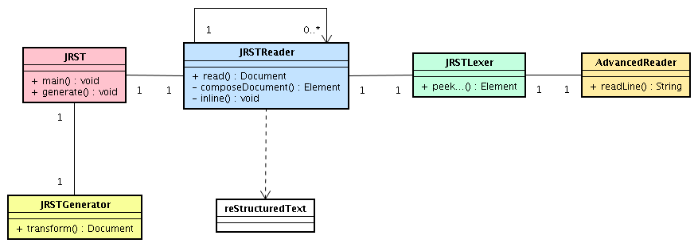

=======================
Developer Documentation
=======================

.. contents::

Class diagram
=============

|classDiagramme|

AdvencedReader Class is used to easily read RST_ file using specifics methods:
  - String readLine() : return a line.
  - String[] readLines(int nb) : return nb lines
  - String[] readWhile(Pattern p) : return lines while they match to the pattern
  ...

**JRSTLexer** Class uses **AdvencedReader** to build XML file, it browses all document to isolate the data types, parameters
and content, so assembling all usefuls informations to build the final XML. It will start by document's head (peekHeader(),
peekDocInfo()), and finally peeking on the body (peekBody()).

**JRSTReader** Class uses **JRSTLexer**, it interprets the returned XML to build the final XML. This one is conform to the Docutils_
DTD. This Class sometimes needs to be called itself when a document part must be interpreted independently of rest. For exemple,
if a table contains a list, we extract the cell's informations for being interpreted. Admonition's content must be considered like an
independant document. When generation is finished, Class **JRSTReader** build summary (composeContent()) and parse all the inline
specificities (inline()), like, italic or bold words, links, footnotes... All that can appear inside a line.

**JRST** Class contents main() method, it's looking after options, files reading and writing. It reads document, parses
it with **JRSTReader** Class and transforms with the wish XSL (if needed) by using **JRSTGenerator** Class.

Generation
==========

|diagrammegeneration|

Links :

  * xml2rst.xsl (convertion from xml of docutils towards rst) : http://www.merten-home.de/FreeSoftware/xml2rst
  * dn2dbk.xsl (convertion from xml of docutils towards docbook) : http://membres.lycos.fr/ebellot/dn2dbk
  * nwalsh xsl (convertion from docbook towards FO and xhtml) : http://nwalsh.com

  * XMLmind (convertion from FO towards ODT and RTF) : http://www.xmlmind.com/foconverter/what_is_xfc.html
  * FOP (convertion from FO towards PDF) : http://xmlgraphics.apache.org/fop

Use exemple
===========

We want to convert this following reStructuredText document (text.rst) to html (text.html) :

::

   =====
   Title
   =====
   
   :Author: Letellier Sylvain
   
   .. Attention:: this text must be interpreted independently
      because it must be interpreted like a **paragraph**

So we use this following command::

   JRST -t html -o text.html text.rst

This sequence diagramme describes the parser's mechanism throughout the generation :

|sequenceDiagramme|

**JRSTGenerator** Class with the XSL file rst2xhtml.xsl, returns following html file::

   <?xml version="1.0" encoding="UTF-8"?>
   <html xmlns="http://www.w3.org/TR/xhtml1/strict">
     <head>
       <meta http-equiv="Content-Type" content="text/html; charset=UTF-8"/>
       <meta name="generator" content="JRST http://jrst.labs.libre-entreprise.org/"/>
       <title>Title</title>
     </head>
     <body>
       <h1>Title</h1>
       <table class="docinfo" frame="void" rules="none">
         <col class="docinfo-name"/>
         <col class="docinfo-content"/>
         <tbody valign="top">
           <tr>
             <th class="docpatterninfo-name">author :</th>
             <td class="docinfo-content">Letellier Sylvain</td>
           </tr>
         </tbody>
       </table>
       

         
attention :

         

           
this text must be interpreted independently
              because it must be interpreted like a <strong>paragraph</strong>
           

         

       

     </body>
   </html>

What display the page (CSS [1]_ was added to layout) :

.. topic:: Titre

   :Author: Letellier Sylvain
   .. Attention:: this text must be interpreted independently
      because it must be interpreted like a **paragraph**
   

Uses external XSL
=================

JRST able to transform DocUtils XML with external XSL [2]_ files.
You must use this following command::

  JRST -x XSLfile, XSLfile2 RSTfile

or::

  JRST --xslFile XSLfile, XSLfile2 RSTfile

JRST process RST_ file, returned DocUtils_ XML will be transformed by JRSTgenerator Class
starting by XSLfile then XSL2file2...

.. [1] `Cascading Style Sheets`_
.. [2] XSL documentation is available here_.

.. _here: ./presentationXSL.html
.. _RST: http://docutils.sourceforge.net/rst.html
.. _Cascading Style Sheets: http://en.wikipedia.org/wiki/Cascading_Style_Sheets
.. _DocUtils: http://docutils.sourceforge.net/docs/ref/doctree.html
.. |diagrammegeneration| image:: images/diagrammeGeneration.png

.. |sequenceDiagramme| image:: images/DiagrammeSequence.png