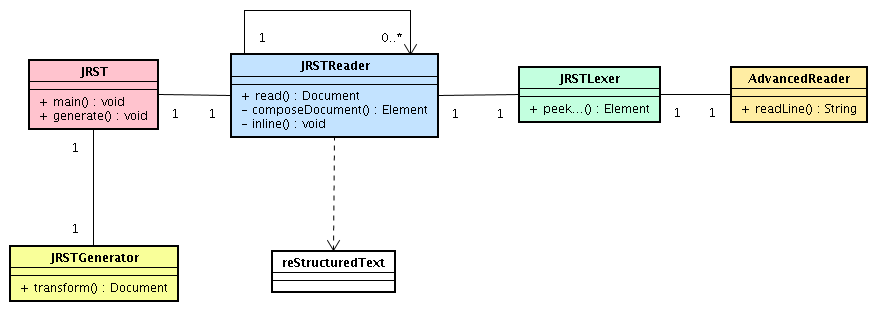

=========================
Documentation développeur
=========================

.. contents:: Sommaire

Le diagramme de Class
=====================

|classDiagramme|

La Class **AdvancedReader** à pour fonction de faciliter la lecture du fichier RST_ grâce à différentes méthodes :
  - String readLine() : renvoie une ligne
  - String[] readLines(int nombresLigne) : renvoie un certain nombre de lignes
  - Stringn[] readWhile(Pattern p) : renvoie les lignes tant qu'elles correspondent au pattern

...

La Class **JRSTLexer** utilise **AdvancedReader** pour construire un fichier XML, il parcours l'ensemble du document pour isoler les types de données, leurs paramètres et leurs contenus, donc rassembler toutes les informations utiles à la mise en forme du XML final. Il va commencer par l'entête du document (peekHeader(), peekDocInfo()) pour ensuite s'intéresser au corps (peekBody()).

La Class **JRSTReader** utilise **JRSTLexer**, il interprète le XML qui lui est renvoyé pour construire le XML final. Celui-ci est conforme à la DTD définie par DocUtils_. Cette Class à parfois besoin de s'appeler elle même lorsque une partie du document doit être interprétée indépendamment du reste. Par exemple, s'il y a une liste dans une case d'un tableau, l'on extrait les informations de la case et on les interprètes, le contenu d'une admoniton (une note) doit lui aussi être considéré comme un document indépendant. Lorsque la génération est terminée, la Class compose le sommaire (composeContent()) puis s'occupe de toutes les spécificités « inline » (inline()), comme par exemple les mots en italique ou gras, les références, les footnotes... Tout ce qui peut apparaître à l'intérieur d'une ligne.

La Class **reStructuredText** référence toutes les variables nécessaires à la génération du XML final.

La Class **JRST** contient la méthode main(), elle gère les options, la lecture et l'écriture des fichiers. Elle lit le document, le parse grâce à la class **JRSTReader** puis applique le XSL désiré (si besoin) grâce à la class **JRSTGenerator**.

La génération
=============

|diagrammegeneration|

Référence :

  * xml2rst.xsl (convertion de xml de docutils vers rst) : http://www.merten-home.de/FreeSoftware/xml2rst
  * dn2dbk.xsl (convertion de xml de docutils vers docbook) : http://membres.lycos.fr/ebellot/dn2dbk
  * les xsl de nwalsh (convertion de docbook vers FO et xhtml) : http://nwalsh.com

  * XMLmind (convertion de FO vers ODT et RTF) : http://www.xmlmind.com/foconverter/what_is_xfc.html
  * FOP (convertion de FO vers PDF) : http://xmlgraphics.apache.org/fop

Exemple d'utilisation
=====================

L'on souhaite convertir le document rst (text.rst) suivant en html (text.html) :

::

   =====
   Titre
   =====

   :Author: Letellier Sylvain

   .. Attention:: texte à être réinterprété comme un fichier rst indépendant
      ceci est considéré comme un **paragraphe**

On utilise donc la commande suivante::

   JRST -t html -o text.html text.rst

Ce diagramme de séquence décrit le fonctionnement du parseur tout au long de la génération :

|sequanceDiagramme|

La Classe **JRSTGenerator**, grâce au fichier XSL rst2xhtml.xsl, renvoie le fichier html suivant::

   <?xml version="1.0" encoding="UTF-8"?>
   <html xmlns="http://www.w3.org/TR/xhtml1/strict">
     <head>
       <meta http-equiv="Content-Type" content="text/html; charset=iso-8859-15"/>
       <meta name="generator" content="JRST http://jrst.labs.libre-entreprise.org/"/>
       <title>Titre</title>
     </head>
     <body>
       <h1>Titre</h1>
       <table class="docinfo" frame="void" rules="none">
         <col class="docinfo-name"/>
         <col class="docinfo-content"/>
         <tbody valign="top">
           <tr>
             <th class="docpatterninfo-name">author :</th>
             <td class="docinfo-content">Letellier Sylvain</td>
           </tr>
         </tbody>
       </table>
       

         
attention :

         

           
texte à être réinterprété comme un fichier rst indépendant
              ceci est considéré comme un <strong>paragraphe</strong>

         

       

     </body>
   </html>

Qui affiche la page (un CSS [1]_ à été ajouté pour la mise en forme) :

.. topic:: Titre

   :Author: Letellier Sylvain
   
   .. Attention:: texte à être réinterprété comme un fichier rst indépendant
      ceci est considéré comme un **paragraphe**

Utilisation de XSL externe
==========================

JRST propose de transformer le XML de docutils_ avec des fichiers XSL [2]_ externe.
Pour cela, il faut utiliser la commande::

  JRST -x fichierXSL, fichierXSL2 fichierRST
ou::

  JRST --xslFile fichierXSL, fichierXSL2 fichierRST

JRST traitera le fichierRST, le XML de DocUtils_ qui est retourné sera transformé par la Class JRSTgenerator
en commençant par le fichierXSL puis par le fichierXSL2...

.. [1] `Cascading Style Sheets`_
.. [2] Une documentation sur le XSL est diponible ici_.

.. _ici: presentationXSL.html
.. _Cascading Style Sheets: http://fr.wikipedia.org/wiki/Feuilles_de_style_en_cascade
.. _RST: http://docutils.sourceforge.net/rst.html
.. _DocUtils: http://docutils.sourceforge.net/docs/ref/doctree.html
.. |diagrammegeneration| image:: images/diagrammeGeneration.png

.. |sequanceDiagramme| image:: images/diagrammeSequance.png